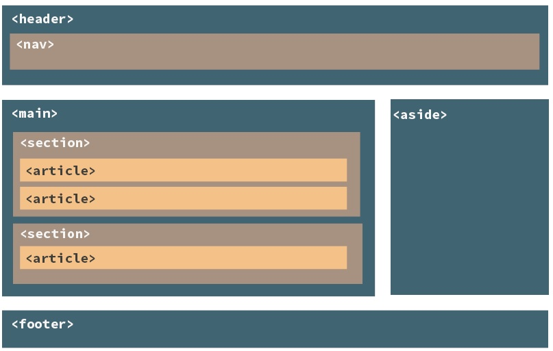

# Recursos para la web

## Instalar Git
- Ir a la dirección: https://git-scm.com/downloads  
- Descargar e instalar la versión correspondiente al sistema operativo que usas.  
- Windows: Video sobre la instalación paso a paso: https://youtu.be/hVMgMHX-W7U    

## Instalar Obsidian
- Ir a la dirección: https://obsidian.md  
- Descargar e instalar la versión correspondiente al sistema operativo que usas.  

## Instalar VS Code
- Ir a la dirección: https://code.visualstudio.com  
- Descargar e instalar la versión correspondiente al sistema operativo que usas.  

## Materiales de consulta en PDF
*Autor desconocido*  
- [Control de versiones Git](git.pdf)
- [Introducción a HTML](html-introduccion.pdf)
- [Etiquetas HTML](html-etiquetas.pdf)
- [Listas y tablas en HTML](html-listas-tablas.pdf)
- [Formularios en HTML](html-formularios.pdf)
- [Introducción a CSS](css-introduccion.pdf)
- [Estructura de CSS](css-estructura.pdf)
- [Selectores en CSS](css-selectores.pdf)
- [Estilos de texto en CSS](css-estilos-texto.pdf)
- [Posicionamiento en CSS](css-posicionamiento.pdf)
- [Flexbox en CSS](css-flexbox.pdf)

Estructura de una página web en HTML5  

## Enlaces
*Todos ellos en inglés.*  
- [HTML reference](https://htmlreference.io/)
- [CSS reference](https://cssreference.io/)
- [W3 Schools](https://www.w3schools.com/)
- [MDN](https://developer.mozilla.org/es/)
- [Boostrap](https://getbootstrap.com/)
- [Tailwind CSS](https://tailwindcss.com/)
- [Minireset CSS](https://jgthms.com/minireset.css/)
- [WYSIWYG](https://jgthms.com/wysiwyg.css/)

[Índice](../../README.md)